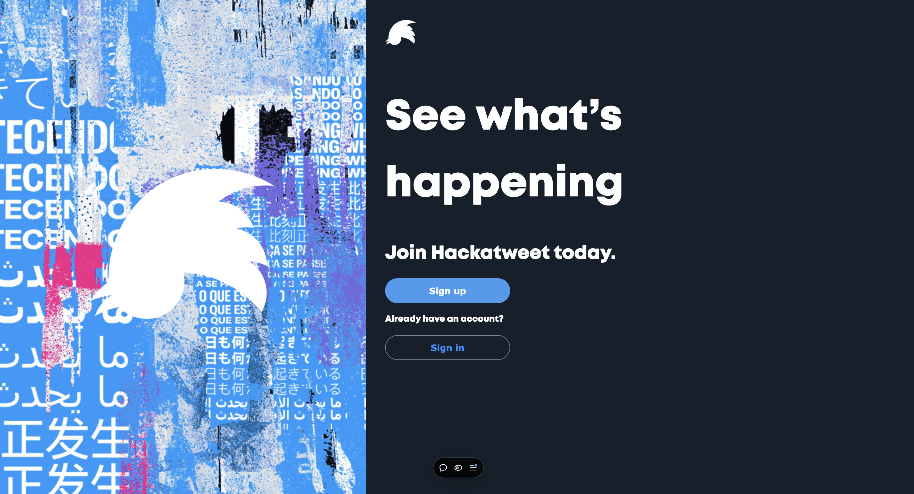

# Hack a Tweet

**Hack a Tweet** is a full-stack web app that replicates core Twitter functionalities. Users can sign up, sign in, post tweets, and interact with other users' content.

## Features

- **User Authentication**: Sign up, sign in, log out.
- **Tweet Creation**: Post tweets up to 280 characters.
- **Hashtags**: Use and track trending hashtags.
- **Interactions**: Like and delete tweets.
- **Dynamic Routing**: Hashtag-specific pages.
- **Secure Auth**: Password hashing, tokens.
- **Persistent Store**: Remain logged in after page refresh.

## Tech Stack

**Frontend**: React, Next.js, Redux  
**Backend**: Node.js, Express, MongoDB  
**Deployment**: Vercel

## Repositories

- **Frontend**: [lacapsule-hackatweet-frontend](https://github.com/vinesk/lacapsule-hackatweet-frontend)
- **Backend**: [lacapsule-hackatweet-backend](https://github.com/vinesk/lacapsule-hackatweet-backend)

## Setup

### Frontend

1. Clone the frontend repo:

   ```bash
   git clone https://github.com/vinesk/lacapsule-hackatweet-frontend.git
   cd lacapsule-hackatweet-frontend
   ```

2. Install frontend dependencies:

   ```bash
   npm install
   ```

3. Create a `.env.local` file with the following:

   ```bash
   NEXT_PUBLIC_BACKEND_URL=https://your-backend-url
   ```

4. Start the frontend:

   ```bash
   npm run dev
   ```

### Backend

1. Clone the backend repo:

   ```bash
   git clone https://github.com/vinesk/lacapsule-hackatweet-backend.git
   cd lacapsule-hackatweet-backend
   ```

2. Install backend dependencies:

   ```bash
   npm install
   ```

3. Create a `.env` file with the following:

   ```bash
   CONNECTION_STRING=your-mongodb-uri
   ```

4. Start the backend:

   ```bash
   npm run start
   ```

## Usage

- **Home Page**: View and post tweets, see trending hashtags.
- **Tweet**: Create tweets up to 280 characters.
- **Interact**: Like tweets, delete your own tweets.
- **Hashtags**: Click on trending hashtags to view related tweets.
- **Search**: Use the search bar on hashtag pages to find specific hashtags.

## License

MIT License. See the [LICENSE](./LICENSE) file for details.
